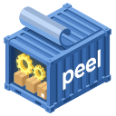

<p align="center">
  
</p>

---

A CLI/TUI tool for inspecting container image layers, written in Rust.

Peel apart your container images — inspect layers, list files, and export to JSON.

## Install

```sh
curl --proto '=https' --tlsv1.2 -LsSf https://github.com/fudanglp/peel/releases/latest/download/peel-installer.sh | sh
```
